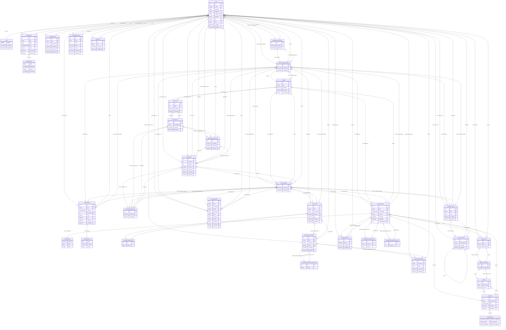

```mermaid
erDiagram

        Role {
            ADMIN ADMIN
STUDENT STUDENT
TEACHER TEACHER
        }
    


        MaterialType {
            MODULE MODULE
QUIZ QUIZ
EXAM EXAM
        }
    


        QuestionType {
            MULTIPLE_CHOICE MULTIPLE_CHOICE
TRUE_FALSE TRUE_FALSE
SHORT_ANSWER SHORT_ANSWER
        }
    


        GradeCategory {
            QUIZ QUIZ
ACTIVITY ACTIVITY
EXAM EXAM
        }
    


        NotificationType {
            INFO INFO
WARNING WARNING
ALERT ALERT
SUCCESS SUCCESS
        }
    
  "User" {
    Int id "🗝️"
    String email 
    String password 
    String firstname 
    String middlename "❓"
    String lastname 
    String lrn "❓"
    Role role 
    DateTime createdAt 
    DateTime updatedAt 
    }
  

  "SchoolYear" {
    Int id "🗝️"
    Int yearStart 
    Int yearEnd 
    Boolean isCurrent 
    Boolean unlocked 
    DateTime createdAt 
    DateTime updatedAt 
    }
  

  "TeacherAssignedSubject" {
    Int id "🗝️"
    DateTime createdAt 
    DateTime updatedAt 
    }
  

  "Assignment" {
    Int id "🗝️"
    String title 
    String instructions "❓"
    DateTime dueDate "❓"
    Decimal hps "❓"
    DateTime createdAt 
    DateTime updatedAt 
    }
  

  "AssignmentAttachment" {
    Int id "🗝️"
    String fileURL 
    }
  

  "AssignmentSubmission" {
    Int id "🗝️"
    String title "❓"
    String comment "❓"
    Decimal score "❓"
    DateTime createdAt 
    DateTime updatedAt 
    }
  

  "AssignmentSubmissionAttachment" {
    Int id "🗝️"
    String fileURL 
    }
  

  "AssignmentFeedback" {
    Int id "🗝️"
    String comment "❓"
    Float mark 
    DateTime createdAt 
    DateTime updatedAt 
    }
  

  "StudentProgress" {
    Int id "🗝️"
    Boolean isDone 
    DateTime createdAt 
    DateTime updatedAt 
    }
  

  "StudentEnrolledSubject" {
    Int id "🗝️"
    DateTime createdAt 
    DateTime updatedAt 
    }
  

  "StudentEnrolledSection" {
    Int id "🗝️"
    DateTime createdAt 
    DateTime updatedAt 
    DateTime deletedAt "❓"
    }
  

  "TeacherSubject" {
    Int id "🗝️"
    DateTime createdAt 
    DateTime updatedAt 
    }
  

  "TeacherSubjectSection" {
    Int id "🗝️"
    DateTime createdAt 
    DateTime updatedAt 
    }
  

  "Subject" {
    Int id "🗝️"
    String title 
    DateTime createdAt 
    DateTime updatedAt 
    String coverImgUrl "❓"
    }
  

  "SubjectMaterial" {
    Int id "🗝️"
    String title "❓"
    MaterialType materialType "❓"
    String content "❓"
    DateTime createdAt 
    DateTime updatedAt 
    Int subjectMaterialId "❓"
    }
  

  "SubjectMaterialAttachments" {
    Int id "🗝️"
    String filename "❓"
    String fileURL 
    }
  

  "SubjectMaterialQuizQuestions" {
    Int id "🗝️"
    Int questionId 
    }
  

  "Question" {
    Int id "🗝️"
    String questionText 
    QuestionType type 
    DateTime createdAt 
    DateTime updatedAt 
    }
  

  "Answer" {
    Int id "🗝️"
    String answerText 
    Boolean isCorrect 
    }
  

  "QuizSession" {
    Int id "🗝️"
    Decimal score "❓"
    DateTime createdAt 
    }
  

  "QuizSessionAnswer" {
    Int id "🗝️"
    String answerText "❓"
    }
  

  "MeetingSession" {
    Int id "🗝️"
    String uuid 
    String meetingID 
    String hostID 
    String hostEmail 
    String topic 
    String startURL 
    String joinURL 
    String password 
    String authCode "❓"
    Boolean onGoing "❓"
    }
  

  "ClassLevel" {
    Int id "🗝️"
    Int level 
    DateTime createdAt 
    DateTime updatedAt 
    }
  

  "ClassSection" {
    Int id "🗝️"
    String sectionName 
    DateTime createdAt 
    DateTime updatedAt 
    }
  

  "CalendarEvent" {
    Int id "🗝️"
    String title "❓"
    String description "❓"
    DateTime eventDate 
    DateTime createdAt 
    DateTime updatedAt 
    }
  

  "Notifications" {
    Int id "🗝️"
    String title "❓"
    String body "❓"
    NotificationType type 
    Boolean read 
    DateTime createdAt 
    DateTime updatedAt 
    }
  

  "UserUpdateRequest" {
    Int id "🗝️"
    Json data "❓"
    Int code 
    DateTime expiry 
    Boolean active 
    DateTime createdAt 
    DateTime updatedAt 
    }
  

  "ForumDiscussion" {
    Int id "🗝️"
    String title "❓"
    String query "❓"
    DateTime createdAt 
    DateTime updatedAt 
    }
  

  "ForumComment" {
    Int id "🗝️"
    String commentText 
    DateTime createdAt 
    DateTime updatedAt 
    }
  

  "StudentGrade" {
    Int id "🗝️"
    String title "❓"
    GradeCategory category 
    Int referenceId "❓"
    Decimal score 
    Decimal hps 
    DateTime createdAt 
    DateTime updatedAt 
    }
  

  "ActivityLog" {
    Int id "🗝️"
    String text 
    DateTime createdAt 
    DateTime updatedAt 
    }
  
    "User" o|--|| "Role" : "enum:role"
    "User" o{--}o "StudentEnrolledSubject" : "StudentEnrolledSubject"
    "User" o{--}o "TeacherAssignedSubject" : "TeacherAssignedSubject"
    "User" o{--}o "AssignmentSubmission" : "AssignmentSubmission"
    "User" o{--}o "StudentProgress" : "StudentProgress"
    "User" o{--}o "MeetingSession" : "MeetingSession"
    "User" o{--}o "QuizSession" : "QuizSession"
    "User" o{--}o "CalendarEvent" : "CalendarEvents"
    "User" o{--}o "Notifications" : "Notifications"
    "User" o{--}o "AssignmentFeedback" : "AssignmentFeedback"
    "User" o{--}o "UserUpdateRequest" : "UserUpdateRequest"
    "User" o{--}o "ForumDiscussion" : "ForumDiscussion"
    "User" o{--}o "ForumComment" : "ForumComment"
    "User" o{--}o "StudentGrade" : "StudentGrade"
    "User" o{--}o "ActivityLog" : "ActivityLog"
    "User" o{--}o "SchoolYear" : "CreatedSchoolYear"
    "User" o{--}o "SchoolYear" : "UpdatedSchoolYear"
    "User" o{--}o "StudentEnrolledSection" : "StudentEnrolledSection"
    "User" o{--}o "TeacherSubject" : "TeacherSubject"
    "SchoolYear" o|--|| "User" : "createdBy"
    "SchoolYear" o|--|o "User" : "updatedBy"
    "SchoolYear" o{--}o "TeacherAssignedSubject" : "TeacherAssignedSubject"
    "SchoolYear" o{--}o "StudentEnrolledSection" : "StudentEnrolledSection"
    "SchoolYear" o{--}o "TeacherSubject" : "TeacherSubject"
    "SchoolYear" o{--}o "TeacherSubjectSection" : "TeacherSubjectSection"
    "TeacherAssignedSubject" o|--|| "User" : "teacher"
    "TeacherAssignedSubject" o|--|| "Subject" : "subject"
    "TeacherAssignedSubject" o|--|| "SchoolYear" : "schoolYear"
    "TeacherAssignedSubject" o{--}o "StudentEnrolledSubject" : "StudentEnrolledSubject"
    "TeacherAssignedSubject" o{--}o "Assignment" : "Assignment"
    "TeacherAssignedSubject" o{--}o "MeetingSession" : "MeetingSession"
    "TeacherAssignedSubject" o{--}o "ForumDiscussion" : "ForumDiscussion"
    "TeacherAssignedSubject" o{--}o "StudentGrade" : "StudentGrade"
    "TeacherAssignedSubject" o{--}o "SubjectMaterial" : "SubjectMaterial"
    "Assignment" o|--|| "TeacherSubject" : "teacherSubject"
    "Assignment" o{--}o "AssignmentAttachment" : "AssignmentAttachment"
    "Assignment" o{--}o "AssignmentSubmission" : "AssignmentSubmission"
    "Assignment" o|--|o "TeacherAssignedSubject" : "TeacherAssignedSubject"
    "AssignmentAttachment" o|--|| "Assignment" : "Assignment"
    "AssignmentSubmission" o|--|| "User" : "Student"
    "AssignmentSubmission" o|--|| "Assignment" : "Assignment"
    "AssignmentSubmission" o{--}o "AssignmentSubmissionAttachment" : "AssignmentSubmissionAttachment"
    "AssignmentSubmission" o{--}o "AssignmentFeedback" : "AssignmentFeedback"
    "AssignmentSubmissionAttachment" o|--|| "AssignmentSubmission" : "AssignmentSubmission"
    "AssignmentFeedback" o|--|| "AssignmentSubmission" : "assignmentSubmission"
    "AssignmentFeedback" o|--|| "User" : "teacher"
    "StudentProgress" o|--|| "SubjectMaterial" : "SubjectMaterial"
    "StudentProgress" o|--|| "User" : "Student"
    "StudentEnrolledSubject" o|--|| "User" : "student"
    "StudentEnrolledSubject" o|--|| "TeacherAssignedSubject" : "teacherSubject"
    "StudentEnrolledSection" o|--|| "User" : "student"
    "StudentEnrolledSection" o|--|| "ClassSection" : "classSection"
    "StudentEnrolledSection" o|--|| "SchoolYear" : "schoolYear"
    "TeacherSubject" o|--|| "Subject" : "subject"
    "TeacherSubject" o|--|| "User" : "teacher"
    "TeacherSubject" o|--|| "SchoolYear" : "schoolYear"
    "TeacherSubject" o{--}o "TeacherSubjectSection" : "TeacherSubjectSection"
    "TeacherSubject" o{--}o "SubjectMaterial" : "SubjectMaterial"
    "TeacherSubject" o{--}o "Assignment" : "Assignment"
    "TeacherSubject" o{--}o "ForumDiscussion" : "ForumDiscussion"
    "TeacherSubject" o{--}o "MeetingSession" : "MeetingSession"
    "TeacherSubject" o{--}o "StudentGrade" : "StudentGrade"
    "TeacherSubjectSection" o|--|| "TeacherSubject" : "teacherSubject"
    "TeacherSubjectSection" o|--|| "ClassSection" : "classSection"
    "TeacherSubjectSection" o|--|| "SchoolYear" : "schoolYear"
    "Subject" o{--}o "TeacherAssignedSubject" : "TeacherAssignedSubject"
    "Subject" o|--|| "ClassLevel" : "classLevel"
    "Subject" o{--}o "SubjectMaterial" : "SubjectMaterial"
    "Subject" o{--}o "TeacherSubject" : "TeacherSubject"
    "SubjectMaterial" o|--|o "MaterialType" : "enum:materialType"
    "SubjectMaterial" o|--|| "TeacherSubject" : "teacherSubject"
    "SubjectMaterial" o{--}o "StudentProgress" : "StudentProgress"
    "SubjectMaterial" o{--}o "SubjectMaterialQuizQuestions" : "SubjectMaterialQuizQuestions"
    "SubjectMaterial" o{--}o "QuizSession" : "QuizSession"
    "SubjectMaterial" o{--}o "SubjectMaterialAttachments" : "SubjectMaterialAttachments"
    "SubjectMaterial" o{--}o "Question" : "Question"
    "SubjectMaterial" o|--|o "Subject" : "Subject"
    "SubjectMaterial" o|--|o "TeacherAssignedSubject" : "TeacherAssignedSubject"
    "SubjectMaterialAttachments" o|--|| "SubjectMaterial" : "subjectMaterial"
    "SubjectMaterialQuizQuestions" o|--|| "SubjectMaterial" : "subjectMaterial"
    "Question" o|--|| "QuestionType" : "enum:type"
    "Question" o|--|| "SubjectMaterial" : "subject"
    "Question" o{--}o "Answer" : "answers"
    "Answer" o|--|| "Question" : "question"
    "Answer" o{--}o "QuizSessionAnswer" : "QuizSessionAnswers"
    "QuizSession" o|--|| "User" : "student"
    "QuizSession" o|--|| "SubjectMaterial" : "quiz"
    "QuizSession" o{--}o "QuizSessionAnswer" : "QuizSessionAnswer"
    "QuizSessionAnswer" o|--|| "QuizSession" : "session"
    "QuizSessionAnswer" o|--|o "Answer" : "choice"
    "MeetingSession" o|--|| "User" : "teacher"
    "MeetingSession" o|--|| "TeacherSubject" : "teacherSubject"
    "MeetingSession" o|--|o "TeacherAssignedSubject" : "TeacherAssignedSubject"
    "ClassLevel" o{--}o "ClassSection" : "ClassSection"
    "ClassLevel" o{--}o "Subject" : "Subject"
    "ClassSection" o|--|| "ClassLevel" : "classLevel"
    "ClassSection" o{--}o "StudentEnrolledSection" : "StudentEnrolledSection"
    "ClassSection" o{--}o "TeacherSubjectSection" : "TeacherSubjectSection"
    "CalendarEvent" o|--|| "User" : "user"
    "Notifications" o|--|| "NotificationType" : "enum:type"
    "Notifications" o|--|| "User" : "user"
    "UserUpdateRequest" o|--|| "User" : "user"
    "ForumDiscussion" o|--|| "User" : "createdBy"
    "ForumDiscussion" o|--|| "TeacherSubject" : "teacherSubject"
    "ForumDiscussion" o{--}o "ForumComment" : "ForumComments"
    "ForumDiscussion" o|--|o "TeacherAssignedSubject" : "TeacherAssignedSubject"
    "ForumComment" o|--|| "User" : "createdBy"
    "ForumComment" o|--|| "ForumDiscussion" : "forumDiscussion"
    "ForumComment" o|--|o "ForumComment" : "parentComment"
    "ForumComment" o{--}o "ForumComment" : "replies"
    "StudentGrade" o|--|| "GradeCategory" : "enum:category"
    "StudentGrade" o|--|| "User" : "student"
    "StudentGrade" o|--|| "TeacherSubject" : "teacherSubject"
    "StudentGrade" o|--|o "TeacherAssignedSubject" : "TeacherAssignedSubject"
    "ActivityLog" o|--|| "User" : "user"
```
